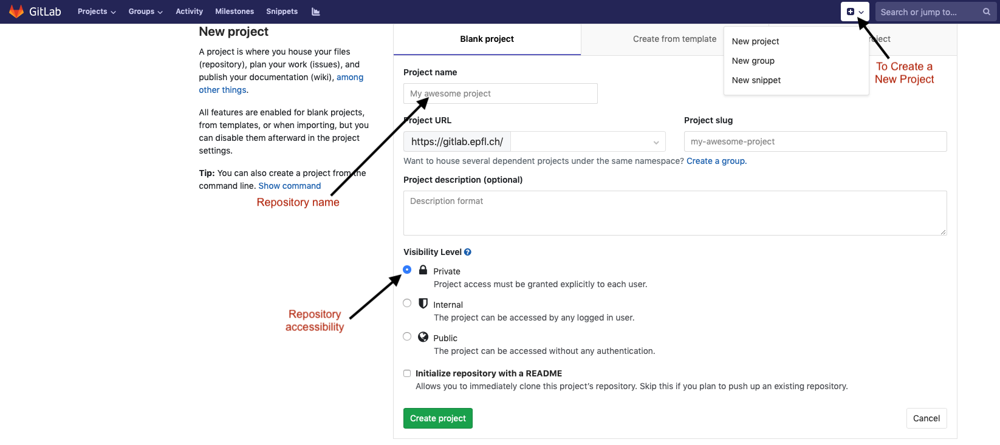

.. _sec:git:

How to use GIT
==============

This document outlines the basic steps to clone and stay up to date with
the CMC-2024 exercises using Git. It is not a comprehensive tutorial on
using Git. For detailed tutorials please use the references below.

Following references are recommended for beginner:

-  `Git for Noobs <https://towardsdatascience.com/git-for-noobs-7a846ce98c9a>`__ answer many questions around git, its basic ideas and philosophy, common commands and different platforms based on git.
-  `A step-by-step guide to git <https://opensource.com/article/18/1/step-step-guide-git>`__ is a guide to help you get started with git, from signing up to making your first commit.
-   `Git & GitHub Crash Course For beginners <https://www.youtube.com/watch?v=SWYqp7iY_Tc&ab_channel=TraversyMedia>`__ is a 32 mins video tutorial for beginners

Resources below can help you advance you git journey and brush up your skills.

-  `Git Cheat sheet <http://ndpsoftware.com/git-cheatsheet.html>`__ in different languages. Make sure to notice span of the commands over different categories.
-  `Interactive tutorial <https://learngitbranching.js.org>`__ is an beginner to advanced tutorial that helps to practice managing branches and commits.
-  `A Visual Git Reference <https://marklodato.github.io/visual-git-guide/index-en.html>`__ a in depth explanation of different commands with flow diagrams.
-  `GitHub basic guide <https://try.github.io/levels/1/challenges/1>`__
-  `GitLab basic guide <https://docs.gitlab.com/ee/gitlab-basics/>`__
- `Git cheat sheet <https://about.gitlab.com/images/press/git-cheat-sheet.pdf>`__ by GitLab. The commands will work for any git based platform.

..
 ## comment mark
   -  `git-guide <http://rogerdudler.github.io/git-guide/>`__
 ##

**Important Note 1**: These resources are to help you learn git. To work and collaborate efficiently for CMC labs and projects, only few frequently used commands are needed for CMC. It's not necessary to go through all the resources. They are listed here to get you started.

**Important Note 2**: All the git commands are same across platforms like GitHub and Gitlab (most common platforms). Except for their web interfaces. Thus the tutorials can be done with any platform of your choice.

.. _sec:git_cloning:

CMC Repository
++++++++++++++

Cloning
-------

1.  If you haven’t already installed git, you can do so from
    `Git <https://git-scm.com/download/>`__

   **Note:** During installation, choose *Use Git from Git bash(Only for windows) only*

1. Open the terminal/bash

     - Windows : Either from the main menu or on your Desktop you
       should now find Git Bash application

     - Mac-OS : Open Terminal using Spotlight search. You can also go to Applications -> Utilities -> Terminal

     - Open a terminal using your default application search.

2.  Navigate to the location where you want to install the CMC exercises
    folder. For example, if you want to navigate to your Desktop:

    - Windows :

      .. code:: bash

                $ cd C:/Users/(YOUR_USER_NAME)/Desktop

    - Mac-OS / Linux:

      .. code:: bash

                $ cd ~/Desktop

3.  Then execute the following command to clone the repository:

    .. code:: bash

              $ git clone https://gitlab.com/farmsim/courses/cmc-2024-students.git

   This would clone the repository with the default folder name
   ``cmc-2024-students``. If you wish to clone with a different folder name, then use
   the following command and replace ``FOLDER_NAME`` with the name of
   the folder you want to clone into:

   .. code:: bash

             $ git clone https://gitlab.com/farmsim/courses/cmc-2024-students.git FOLDER_NAME

Pulling
-------

In order to stay up to date with the changes made in the repository, you
will have to do a git pull to get the latest version of the exercises.

1.  Navigate to the exercise directory (Like you did while cloning!)
    **NOTE :** You need to be anywhere inside the repository directory!!. If in doubt you used the command ``pwd`` to see present location in the terminal/bash.

2.  Execute the following command:

    .. code:: bash

              $ git pull origin master

If you have the latest version then the output of the above command
should be:

.. code:: bash

          $ Already up-to-date!

Since this is a public repository for all students, you can not push
your changes to the repository.

.. _sec:git_creat-new-repos:

Personal Repository
+++++++++++++++++++

This section describes how you can create your own repository to
maintain your code and make the best use of GIT throughout the course.
This is not necessary to complete the exercises during the course.

.. _sec:git_creat-new-repos-1:

Creating a new repository
-------------------------

Figure `2 <#fig:git-create-repo>`__ shows the different options while
creating a new repository. It is important to set the
visibility/accessibility of your repository to Internal as it makes sure
that your work is not visible to everyone unless you give someone
explicit permissions later on.

   Creating a new git repository

.. _sec:git_personal-cloning:

Cloning
-------

The newly created repository can be cloned to your computer using the
same steps described earlier to clone the main exercise repository.

.. code:: bash

   $ git clone {REPOSITORY_CLONE_URL}

.. _sec:git_personal-status:

Status
------

One of the most important elements to keep track of your cloned
repository is to keep track of its status. You can do so at any time by
navigating in to the cloned repository on your terminal and then
executing the following command :

.. code:: bash

   $ git status

The output of the command will be explained in the following several
sub-sections.

.. _sec:git_personal_push:

Pushing
-------

Once you have cloned the repository, you can now start populating your
cloned folder with the relevant files. GIT offers several stages in
maintaining your files:

.. _sec:git_personal-untracked-files:

Stage 1 - Untracked files
~~~~~~~~~~~~~~~~~~~~~~~~~

When new files is added for the first time to the cloned repository on
your computer, GIT recognizes the new files and add it under the
category of untracked files. Meaning GIT will not keep track of any
changes made to these files even though they are inside the repository.

.. _sec:git_stage-2-tracked:

Stage 2 - Tracked files
~~~~~~~~~~~~~~~~~~~~~~~

One you decide a particular file needs to be tracked, you need to tell
GIT explicitly to do so. The command to do so is the following,

.. code:: bash

   $ git add {FILE}

The above command creates a snapshot of the file you are interested in.
This does NOT mean any changes you make after are kept track of, when
ever you think it is important to take a snapshot of the change you made
you need to execute this command on every file you are interested in.
This basically overwrites the previous snapshot you made unless you
committed the files.

.. _sec:git_stage-3-commit:

Stage 3 - Commit
~~~~~~~~~~~~~~~~

Once you decided that a particular snapshot that you added (one/several
files) need to remembered as part of your history of changes, you need
to commit them. You can commit your changes using the command,

.. code:: bash

   $ git commit

This command will open up your default text editor from the terminal.
Here you are expected to write a short message describing the changes
you made to the files that you want keep in history. This helps you
later on to quickly look at your history messages in a readable format
to know the overview of changes made during different stages of
development. After you are done, the a snapshot of this history is now
saved on your computer locally.

.. _sec:git_stage-4-pushing:

Stage 4 - Pushing
~~~~~~~~~~~~~~~~~

Finally when you decide that the changes you made along with your
history should be seen by other members or needs to be stored on the
cloud, you need to push the history to the online repository using the
command:

.. code:: bash

   $ git push

The first time you do this you have to tell GIT where you are trying to
push the changes using the command,

.. code:: bash

   $ git push --set-upstream origin master

Where, origin represents that you are trying to push to the default
online repository. master represents the main branch of the repository
that you are trying to push to.
