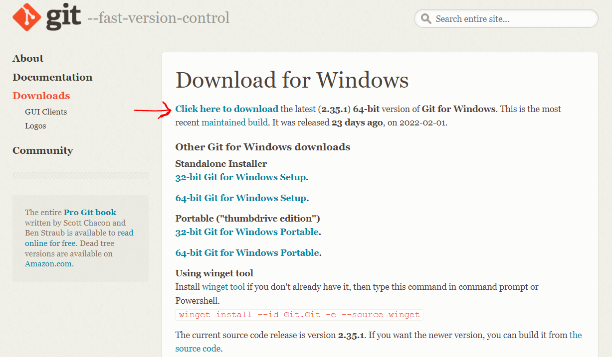

.. _sec:git-install:

Git Installation
================

This document outlines the basic steps to install Git on your machine.
If you already have Git installed, you can skip this step.

.. _sec:Windows:

Windows
+++++++

You can download a Git installer from the `Git website <https://git-scm.com/downloads>`__, selecting the Windows option.

Be sure to install the latest version of Git, as shown in Figure `1 <#fig:git-download-win>`__.

   GIT Download

To complete the installation, go to your download folder and double click on the file named 'Git-2.35.1.2-64-bit.exe'.
Note that the version of the file might change with respect to the one shown here.

Then follow the steps 4 to 20 from this `Git installation guide <https://phoenixnap.com/kb/how-to-install-git-windows/>`__
to complete the installation of Git.

To be sure that you correctly installed git on your computer, you can open Git bash
from your start menu and type the following command.

.. code:: bash

   $ git --version

Which should return something like

.. code:: bash

   git version 2.9.2

Finally, you need to configure your Git username and email using the following commands, 
**replacing Emma's name and email with your own**. These details will be associated with any commits that you create

.. code:: bash

   $ git config --global user.name "Emma Paris"
   $ git config --global user.email "emma.paris@epfl.ch"

.. _sec:Mac:

Mac-OS
++++++

Be sure to have :math:`brew` installed on your machine. 
Otherwise, you can install it from `homebrew <https://brew.sh//>`__

Open a terminal and run the following command.

.. code:: bash

   $ brew install git

In case of problems, you can check other installation methods from this `Git installation guide for Mac-OS <https://git-scm.com/download/mac>`__

To be sure that you correctly installed git on your computer, you can type the following command.

.. code:: bash

   $ git --version

Which should return something like

.. code:: bash

   git version 2.9.2

Finally, you need to configure your Git username and email using the following commands, 
**replacing Emma's name and email with your own**. These details will be associated with any commits that you create

.. code:: bash

   $ git config --global user.name "Emma Paris"
   $ git config --global user.email "emma.paris@epfl.ch"

.. _sec:Linux:

Linux
++++++

Open a terminal and run the following commands.

.. code:: bash

   $ sudo apt-get update
   $ sudo apt-get install git

To be sure that you correctly installed git on your computer, you can type the following command.

.. code:: bash

   $ git --version

Which should return something like

.. code:: bash

   git version 2.9.2

Finally, you need to configure your Git username and email using the following commands, 
**replacing Emma's name and email with your own**. These details will be associated with any commits that you create

.. code:: bash

   $ git config --global user.name "Emma Paris"
   $ git config --global user.email "emma.paris@epfl.ch"
