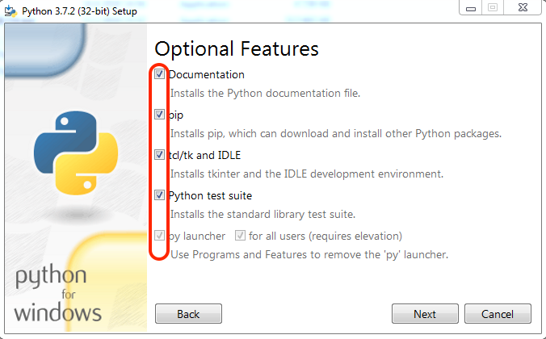

.. _sec:python-install:

Python3 Installation
====================

.. _sec-win:installation-python-windows:

Windows
+++++++

.. _sec-win:checking-if-python:

Checking if python exists
~~~~~~~~~~~~~~~~~~~~~~~~~

Before installing please check if you already have python installed on
your computer. To do so, first open a shell like the command prompt or Git Bash.

Once the shell is open execute the following commands,

.. code:: bash

   $ python3 -V

If the command returns a ``Python 3`` version, then you can skip the Python
installation section and continue with the rest.

.. _sec-win:installation-python:

Python installation
~~~~~~~~~~~~~~~~~~~

To download and install Python3 use the link :
`Python-Windows <https://www.python.org/downloads/windows/>`__

.. note::

   During installation, when you see the pop up window figure
   `1 <#fig:win-py-step1>`__ make sure you check on the box **Add Python
   to PATH** and you click on the customize installation option.

Next, you will see figure `2 <#fig:win-py-step2>`__ where you need to
make sure all the check boxes are ticked. Finally in the advanced
options step like figure `3 <#fig:win-py-step3>`__ you need to tick the
choices like shown in the figure unless you are sure you know the
implications of your choices.

.. figure:: figures/python_install_1.png
   :alt: Python installation customization - Step 1
   :name: fig:win-py-step1

   Python installation customization - Step 1

   Python installation customization - Step 2

.. figure:: figures/python_install_3.png
   :alt: Python installation customization - Step 3
   :name: fig:win-py-step3

   Python installation customization - Step 3

*Install latest version*

After installation, to verify that everything is working open a shell
again and run the above commands to check the python versions.

.. _sec-win:pip:

Pip3
----

Python has a huge repository of packages that are widely used for
different functions. In order to obtain these packages there are several
package managers. The one we will be using during this course will be
the official package installer for Python called :math:`pip3`.

.. _sec-win:checking-if-pip:

Checking if pip exists
~~~~~~~~~~~~~~~~~~~~~~

If you installed Python based on the instructions above then :math:`pip3` should
be installed by default. Or it may have been already installed on your
computer if Python had been pre-installed. To check if :math:`pip3` exists, open
Git Bash and execute the following command:

:math:`pip` or :math:`pip3` depends on your system. 
Typically they differentiate ones installed with python2 and python3 respectively. Since we are using
python3 in this course, please *use pip3 by default*. 

.. code:: bash

   $ pip3 --version

If :math:`pip3` is already installed the above
command should print the version of :math:`pip` along with the python and
its version associated with it. **Make sure that the python version is 3**

.. _sec-mac:installation-python-MacOS:

MacOS
+++++

.. _sec-mac:checking-if-python:

Checking if python3 exists
~~~~~~~~~~~~~~~~~~~~~~~~~~

Before installing please check if you already have python installed on
your computer. To do so open terminal application. Once terminal is open
execute the following commands,

.. code:: bash

   $ python3 -V

If it return a ``Python 3`` version then you can skip the Python
installation section and continue with the rest.

.. _sec-mac:installation-python:

Python installation
~~~~~~~~~~~~~~~~~~~

To download and install Python use the link :
`MacOS <https://www.python.org/downloads/mac-osx/>`__

During installation step make sure you choose customize option like in
figure `4 <#fig:mac-py-step1>`__ and then confirm that all the check
boxes are selected like in figure `5 <#fig:mac-py-step2>`__

.. figure:: figures/python_install_4.png
   :alt: Python installation customization - Step 1
   :name: fig:mac-py-step1

   Python installation customization - Step 1

.. figure:: figures/python_install_5.png
   :alt: Python installation customization - Step 2
   :name: fig:mac-py-step2

   Python installation customization - Step 2

*Install Latest Version*

After installation to verify if everything is working open terminal
again and run the commands in section
`3.1.1 <#sec-mac:checking-if-python>`__.

.. _sec-mac:pip:

Pip3
----

Python has a huge repository of packages that are widely used for
different functions. In order to obtain these packages there are several
package managers. The one we will be using during this course will be
the official package installer for Python3 called :math:`pip3`.

.. _sec-mac:checking-if-pip:

Checking if pip3 exists
~~~~~~~~~~~~~~~~~~~~~~~~~

If you installed Python based on the instructions above then :math:`pip3` should
be installed by default. Or it may have been already installed on your
computer if Python had been pre-installed. To check if :math:`pip3` exists, open
terminal and execute the following command:

:math:`pip` or :math:`pip3` depends on your system. Typically they
differentiate ones installed with python2 and python3 respectively.

.. code:: bash

   $ pip3 --version

If :math:`pip3` is already installed then the command above
will print the version of :math:`pip3` along with the python and
its version associated with it. **Make sure that the python version is 3**

.. _sec-lin:installation-python-linux:

Linux
++++++

*These instruction are for Ubuntu or other Debian-based distributions.
The setup for other Linux distributions should be adapted accordingly.*

.. _sec-lin:checking-if-python:

Checking if python3 exists
~~~~~~~~~~~~~~~~~~~~~~~~~~

Before installing please check if you already have python installed on
your computer. To do so open terminal application. Once terminal is open
execute the following command. 

.. code:: bash

   $ python3 -V

If the command returns a ``Python 3`` version then you can skip the Python
installation section and continue with the rest.

.. _sec-lin:installation-python:

Python installation
~~~~~~~~~~~~~~~~~~~

To download and install Python do the following steps:

-  Open terminal application

-  Execute the command:

   .. code:: bash

      $ sudo apt-get install python3

   The above command will ask you to enter your system password before
   beginning the installation process.

After installation to verify if everything is working open terminal
again and run the commands in section
`4.1.1 <#sec-lin:checking-if-python>`__.

.. _sec-lin:pip:

Pip3
----

Python has a huge repository of packages that are widely used for
different functions. In order to obtain these packages there are several
package managers. The one we will be using during this course will be
the official package installer for Python3 called :math:`pip3`.

.. _sec-lin:checking-if-pip:

Checking if pip3 exists
~~~~~~~~~~~~~~~~~~~~~~~~~

If you installed Python based on the instructions above then :math:`pip3` should
be installed by default. Or it may have been already installed on your
computer if Python had been pre-installed. To check if :math:`pip3` exists, open
terminal and execute the following command:

:math:`pip` or :math:`pip3` depends on your system. Typically they
differentiate ones installed with python2 and python3 respectively.

.. code:: bash

   $ pip3 --version

If :math:`pip3` is already installed then the above command will print 
the version of :math:`pip3` along with the python and
its version associated with it. **Make sure that the python version is 3**