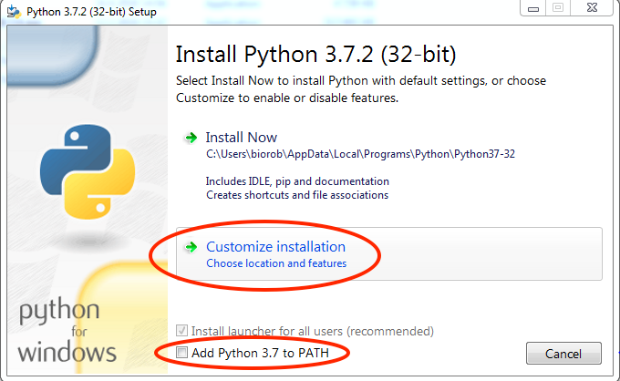

=========
Windows
=========

.. _sec:python-win:

Python
------

.. _sec-win:checking-if-python:

Checking if python exists
~~~~~~~~~~~~~~~~~~~~~~~~~

Before installing please check if you already have python installed on
your computer. To do so open Git Bash (If you haven't installed this application you can do so following the link `Git <https://git-scm.com/download/win>`__)

Once Git Bash is open execute the following commands,

.. code:: bash

   $ python -V

.. code:: bash

   $ python3 -V

If either of them returns ``Python 3`` then you can skip the Python
installation section and continue with the rest.

.. _sec-win:installation-python:

Python installation
~~~~~~~~~~~~~~~~~~~

To download and install Python use the link :
`Python-Windows <https://www.python.org/downloads/windows/>`__

During installation, when you see the pop up window figure
`1 <#fig:win-py-step1>`__ make sure you check on the box *Add Python
to PATH* and you click on the customize installation option.

Next, you will see figure `2 <#fig:win-py-step2>`__ where you need to
make sure all the check boxes are ticked. Finally in the advanced
options step like figure `3 <#fig:win-py-step3>`__ you need to tick the
choices like shown in the figure unless you are sure you know the
implications of your choices.

   Python installation customization - Step 1

.. figure:: figures/python_install_2.png
   :alt: Python installation customization - Step 2
   :name: fig:win-py-step2

   Python installation customization - Step 2

.. figure:: figures/python_install_3.png
   :alt: Python installation customization - Step 3
   :name: fig:win-py-step3

   Python installation customization - Step 3

*Install latest version*

After installation to verify if everything is working open Git Bash
again and run the above commands to check the python versions.

.. _sec-win:pip:

Pip
---

Python has a huge repository of packages that are widely used for
different functions. In order to obtain these packages there are several
package managers. The one we will be using during this course will be
the official package installer for Python called :math:`pip`.

.. _sec-win:checking-if-pip:

Checking if pip exists
~~~~~~~~~~~~~~~~~~~~~~

If you installed Python based on the instructions above then :math:`pip` should
be installed by default. Or it may have been already installed on your
computer if Python had been pre-installed. To check if :math:`pip` exists, open
Git Bash and execute the following command:

:math:`pip` or :math:`pip3` depends on your system. Typically they
differentiate ones installed with python2 and python3 respectively.

.. code:: bash

   $ pip --version

.. code:: bash

   $ pip3 --version

If :math:`pip` is already installed then at least one of the above
commands should print the version of the :math:`pip` along with the python and
its version associated with it. **Make sure that the python version is 3**

.. _sec-win:installation-pip:

Pip installation
~~~~~~~~~~~~~~~~

If you have verified that :math:`pip` is not installed on your computer then in
order to install :math:`pip` you are expected to have either cloned or
downloaded the exercise repository by now.

-  Open Git Bash

-  Navigate to the location where you have downloaded the exercise
   repository. You can use the command :math:`cd` to change directories
   and :math:`pwd` to check you current directory.

-  Inside the exercise repository navigate to **extras** folder and
   execute the following command:

.. code:: bash

   $ python get-pip.py

*Make sure command*\ **python**\ *refers to python-3. To check use the
commands mentioned in Python Installation section to get the
corresponding python version. Accordingly use either python or python3
commands*

Check if you have installed everything correctly by referring to
`2.2.1 <#sec-win:checking-if-pip>`__.

.. .. _sec-win:spyder:

.. Spyder
.. ------

.. Python programs can be written and run in several ways, it can be simply
.. done on a terminal by running *python* or *ipython*. While this method
.. is limited for simple programs, larger programs will be written using a
.. text-editor or an Integrated Development Environment (IDE). Though it is
.. not necessary to have an IDE for programming in Python, having one will
.. bring many features that are useful while starting new

.. .. _sec-win:installation-spyder:

.. Installation
.. ~~~~~~~~~~~~

.. -  Open Git Bash

.. -  Next, install spyder with the command:

..    .. code:: bash

..       $ pip install spyder

..    or

..    .. code:: bash

..       $ pip3 install spyder

.. .. _sec-win:checking-if-spyder:

.. Checking spyder
.. ~~~~~~~~~~~~~~~

.. To check if spyder is installed, execute the following command from Git
.. Bash

.. .. code:: bash

..    $ spyder3

.. If everything is working then Spyder IDE should open and you are ready
.. to begin with the exercises.

Virtual Environment
-------------------

Before installing the libraries that will be needed for the lectures, we will set up a virtual environment.
At its core, the main purpose of Python virtual environments is to create an isolated collection of packages for Python projects. 
This means that each project can have its own dependencies, regardless of those used by every other project.
Using a virtual environment will allow you to work separately on course-related exercises without the risk of conflicts with
other projects.

We will provide a guide for setting up your Python virtual environment, for additional information, check the official PyPa website 
`Installing packages using pip and virtual environments <https://packaging.python.org/en/latest/guides/installing-using-pip-and-virtual-environments/#creating-a-virtual-environment/>`__

.. _sec-win:venv-installation:

Virtual environment installation
~~~~~~~~~~~~~~~~~~~~~~~~~~~~~~~~

.. note::
   If you are using Python 3.3 or newer, the :math:`venv` module is the preferred way to create and manage virtual environments. 
   :math:`venv` is included in the Python standard library and requires no additional installation. If you are using :math:`venv`, you may skip this section.

:math:`virtualenv` is an alternative to :math:`venv` that should be used for previous version of Python 3 or Python 2.
To install :math:`virtualenv`, open the command prompt and run the following commands.

.. code:: bash

   $ py -m pip install virtualenv

.. code:: bash

   $ py -m pip3 install --user virtualenv

.. include:: <isonum.txt> 
.. |win|   unicode:: U+229E .. WIN

.. note::
   On windows, you can open a command prompt by typing 'command prompt' on the search bar.
   Alternatively you can open one by typing :math:`WIN`|WIN| + :math:`R` followed by :math:`cmd` .

.. _sec-win:venv-creation:

Venv creation
~~~~~~~~~~~~~
To create a virtual environment, go to your project’s directory and run venv. If you are using :math:`virtualenv`, replace :math:`venv` with :math:`virtualenv` in the below commands.

.. code:: bash

   $ cd path/to/project/folder
   $ py -m venv my_virtual_environment

This will create a folder named my_virtual_environment containing the virtual Python installation.
Note that, in principle, the virtual environment can be created anywhere in your system's directories, it is however good practice
to store the environment together with the project(s) exploiting it.

.. note::
   You should exclude your virtual environment directory from your version control system using .gitignore or similar.

Venv activation
~~~~~~~~~~~~~~~
Before you can start installing or using packages in your virtual environment you’ll need to activate it. 
Activating a virtual environment will put the virtual environment-specific python and :math:`pip` executables into your shell’s PATH.

.. code:: bash

   $ cd path/to/project/folder
   $ ./my_virtual_environment/Scripts/activate

You can confirm you’re in the virtual environment by checking the location of your Python interpreter:

.. code:: bash

   $ where python

It should be in the my_virtual_environment directory:

.. code:: bash

   $ path/to/project/folder/my_virtual_environment/Scripts/python.exe

As long as your virtual environment is activated :math:`pip` will install packages into that specific environment and you’ll be able to 
import and use packages in your Python application.

.. note::
   If you are using an IDE like Visual Studio Code, make sure that the Python interpreter path corresponds to the
   one of your virtual environment.

.. _sec-win:venv-deactivation:

Venv deactivation
~~~~~~~~~~~~~~~~~
If you want to switch projects or otherwise leave your virtual environment, simply run:

.. code:: bash

   $ deactivate

If you want to re-enter the virtual environment just follow the same instructions above about activating a virtual environment. 
There’s no need to re-create the virtual environment.

.. _sec-win:venv-installpackages:

Installing packages
~~~~~~~~~~~~~~~~~~~
When your virtual environment is active, you can easily install packages using :math:`pip`. 

.. code:: bash

   $ pip install <packagename>

.. code:: bash

   $ pip3 install <packagename>

Note that you can also specify the version of the package you want to install.

.. code:: bash

   $ pip install <packagename>==1.15.4

.. code:: bash

   $ pip3 install <packagename>==1.15.4

Uninstalling packages
~~~~~~~~~~~~~~~~~~~~~
Uninstalling a package with :math:`pip` is as easy as running the following command.

.. code:: bash

   $ pip uninstall numpy

.. code:: bash

   $ pip3 uninstall numpy

Requirements
------------

The final step before starting of with the exercise is to install a few
necessary packages. We will be using :math:`pip` to this.

-  Open terminal (Git Bash on Windows)

-  Navigate in the terminal to the exercise repository on your computer

-  Execute the following command once you are in the root of the
   repository:

   .. code:: bash

      $ pip install -r requirements.txt

   or

   .. code:: bash

      $ pip3 install -r requirements.txt

   Use :math:`pip` or :math:`pip3` depending on the one that refers to python3

The *requirements.txt* installs the following packages:

-  numpy : Scientific computing package for python

-  matplotlib : Matlab like plotting tool for python

-  farms_pylog : Module for logging messages during code runtime

After successfully completing the installation steps in the previous
sections, you can now get started with programming Lab0. Python
is not just a computational tool but a very powerful programming
language. This means having to learn a few more extra concepts to get
your job done. There are a ton of references available online for those
who are interested in learning Python in depth. We will try to provide
the necessary references to help with the concepts that are useful
during the course as and when needed.
